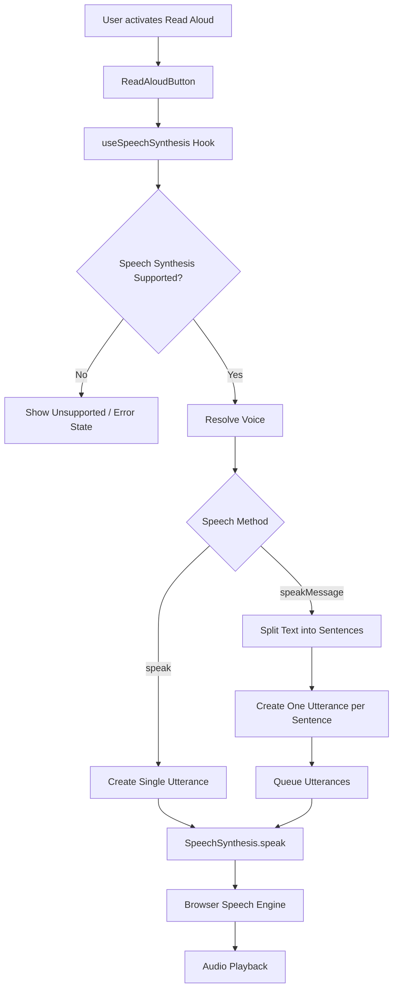
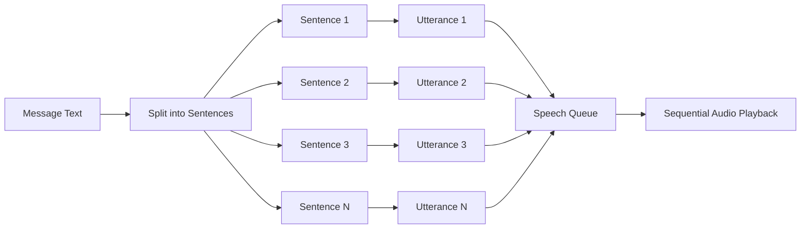

# 🔊 Speech Synthesis

WorkSphere provides text-to-speech functionality using the browser's native **Web Speech API**. The implementation is exposed through the `useSpeechSynthesis` hook and can be used by UI components such as `ReadAloudButton` to read text aloud.

Speech synthesis is performed locally through the browser's `SpeechSynthesis` API. Available voices and browser behavior may vary depending on the browser and operating system.

---

## Architecture

The speech synthesis flow is:



---

## Web Speech API Integration

The `useSpeechSynthesis` hook integrates with two browser APIs:

- `SpeechSynthesis`
- `SpeechSynthesisUtterance`

Support is detected on the client by checking that both `speechSynthesis` and `SpeechSynthesisUtterance` are available.

The hook exposes an `isSupported` state so consuming components can determine whether speech synthesis is available.

When speech synthesis is unavailable, attempting to start speech sets an error message instead of causing the application to fail.

### Basic speech flow

The `speak()` method:

1. Checks that the Web Speech API is available.
2. Uses the provided text override or the hook's default text.
3. Ignores empty or whitespace-only text.
4. Cancels any existing browser speech synthesis.
5. Creates a `SpeechSynthesisUtterance`.
6. Applies the configured playback rate and pitch.
7. Resolves the appropriate voice.
8. Starts playback using `window.speechSynthesis.speak()`.

The `SpeechSynthesisUtterance` lifecycle is used to update application state:

- `onstart` → marks speech as active.
- `onend` → marks speech as finished.
- `onpause` → marks playback as paused.
- `onresume` → clears the paused state.
- `onerror` → stores the speech synthesis error.

---

## Voice Selection

WorkSphere persists the selected voice using `localStorage`.

The storage key is:

```text
worksphere_selected_voice_uri
```

Only the voice URI is persisted rather than the complete `SpeechSynthesisVoice` object. This allows the application to resolve the voice again from the voices currently exposed by the browser.

### Voice resolution order

When selecting a voice, the application follows this general fallback strategy:

```text
Currently selected voice still available?
              │
              ├── Yes ──► Use selected voice
              │
              ▼ No
Persisted voice URI available?
              │
              ├── Yes + voice found ──► Use persisted voice
              │
              ▼ No / unavailable
Voice matching requested language?
              │
              ├── Yes ──► Use language-matched voice
              │
              ▼ No
System default voice?
              │
              ├── Yes ──► Use default voice
              │
              ▼ No
First available voice
              │
              ▼
No voice resolved
              │
              ▼
Use requested language via utterance.lang
```

### 1. Currently selected voice

If a voice is already selected and remains available in the browser's current voice list, that voice is retained.

### 2. Persisted voice URI

If the selected voice is no longer available, the hook checks the `worksphere_selected_voice_uri` value stored in `localStorage`.

If a voice with the persisted URI is available, it becomes the active voice.

This allows a user's voice preference to survive page reloads and future sessions when the same voice remains available.

### 3. Language match

If the persisted voice cannot be found, the hook looks for a voice whose language begins with the requested language.

For example, with:

```ts
lang = "en-US"
```

the implementation searches for a voice where:

```ts
voice.lang.startsWith("en-US")
```

### 4. System default

If no language-matched voice is available, the hook looks for a voice marked as the browser's default voice.

### 5. First available voice

If no default voice is found, the first available voice is used as a final voice-selection fallback.

### 6. Language-only fallback

If no voice can be resolved, the utterance uses the requested language through `SpeechSynthesisUtterance.lang`.

This allows the browser's speech synthesis implementation to determine the appropriate voice.

---

## Voice Availability

Browsers may initially return an empty voice list. Some browsers populate their available voices asynchronously.

To handle this, the hook:

1. Calls `speechSynthesis.getVoices()` during initialization.
2. Updates the voice list when voices are available.
3. Listens for the `voiceschanged` event when supported.

The voice list should therefore not be assumed to be populated immediately when the page first loads.

---

## Playback Rate

Speech playback speed is configurable through the `setRate()` method.

The supported playback range is:

```text
0.75x ───────────────────────── 2.0x
```

The value is clamped before being stored:

```ts
const clampedRate = Math.max(0.75, Math.min(2, newRate));
```

This means:

| Requested Rate | Effective Rate |
|---|---|
| Less than `0.75` | `0.75x` |
| `0.75` to `2.0` | Requested value |
| Greater than `2.0` | `2.0x` |

The available predefined speed options are:

```ts
[0.75, 1, 1.25, 1.5, 1.75, 2]
```

If the rate is changed while speech is active, the hook restarts speech using the updated rate.

---

## Pitch

Speech pitch can also be configured using `setPitch()`.

Pitch values are clamped to:

```text
0 ───────────── 2
```

The default pitch is `1`.

---

## Sentence-Level Utterance Queueing

The `speakMessage()` method is designed for reading longer messages.

Instead of creating one large utterance for the entire message, the text is split into individual sentences.

The current sentence splitter uses the following boundaries:

```text
.
!
?
```

It splits when these punctuation marks are followed by whitespace.

For example:

```text
This is the first sentence. This is the second sentence! Is this the third?
```

becomes:

```text
Sentence 1 → "This is the first sentence."
Sentence 2 → "This is the second sentence!"
Sentence 3 → "Is this the third?"
```

Each sentence becomes a separate `SpeechSynthesisUtterance`.

The utterances are then queued sequentially using:

```ts
window.speechSynthesis.speak(utterance);
```

### Queue flow



The hook tracks:

- `speakingMessageId` — the message currently being read.
- `speakingSentenceIndex` — the sentence currently being played.

The `onStart` callback is triggered when the first sentence starts, while `onEnd` is triggered after the final sentence finishes.

If an error occurs during queued playback, the active speech state is cleared and the provided `onError` callback is invoked.

---

## Controlling Playback

The hook provides several playback controls.

| Method | Description |
|---|---|
| `speak()` | Reads the provided or default text as one utterance |
| `speakMessage()` | Splits a message into sentences and queues them |
| `pause()` | Pauses browser speech synthesis |
| `resume()` | Resumes paused speech |
| `cancel()` | Cancels active speech and clears playback state |
| `stopSpeech()` | Alias for cancelling active speech |
| `setRate()` | Changes playback speed, clamped to `0.75–2.0` |
| `setPitch()` | Changes pitch, clamped to `0–2` |
| `setVoice()` | Selects and persists a voice |

Starting `speakMessage()` first cancels any currently active speech to prevent multiple messages from playing simultaneously.

The hook also cancels active speech when the component using it is unmounted.

---

## Browser Testing

Speech synthesis depends on the browser's Web Speech API implementation and the voices installed or exposed by the operating system. Testing should therefore be performed across multiple browsers.

### Chrome

1. Open WorkSphere in a recent version of Google Chrome.
2. Navigate to a page containing the `ReadAloudButton`.
3. Click **Read Aloud**.
4. Confirm that speech begins.
5. Test pause and resume.
6. Test stopping and restarting playback.
7. Test each supported playback rate:
   - `0.75x`
   - `1x`
   - `1.25x`
   - `1.5x`
   - `1.75x`
   - `2x`
8. Select a different available voice.
9. Reload the page.
10. Confirm that the selected voice is restored when the voice is still available.
11. Test a longer message to verify sentence-level queueing.
12. Confirm that the current message and sentence state update while playback progresses.

---

### Safari

1. Open WorkSphere in a recent version of Safari.
2. Confirm that the browser exposes `speechSynthesis` and `SpeechSynthesisUtterance`.
3. Open a page containing the read-aloud functionality.
4. Start speech playback.
5. Verify pause, resume, and stop behavior.
6. Test multiple playback rates.
7. Test available voice selection.
8. Reload the page and verify persisted voice selection when possible.
9. Test a multi-sentence message.
10. Confirm that sentences are played sequentially.

Voice availability may differ from Chrome because Safari uses the voices exposed by the operating system.

---

### Firefox

1. Open WorkSphere in a recent version of Firefox.
2. Confirm whether `speechSynthesis` and `SpeechSynthesisUtterance` are available.
3. Start the read-aloud feature.
4. Test pause, resume, and stop controls.
5. Test playback rates between `0.75x` and `2.0x`.
6. Test voice selection using the voices available in Firefox.
7. Reload the application and test persisted voice selection.
8. Test a multi-sentence message and verify sequential playback.

If speech synthesis is unavailable in the test environment, the application should expose the unsupported state rather than crashing.

---

## Cross-Browser Test Matrix

| Test Case | Chrome | Safari | Firefox |
|---|---|---|---|
| Speech synthesis support detected | ☐ | ☐ | ☐ |
| Read Aloud starts playback | ☐ | ☐ | ☐ |
| Single-text `speak()` works | ☐ | ☐ | ☐ |
| Sentence-level `speakMessage()` works | ☐ | ☐ | ☐ |
| Sentences play sequentially | ☐ | ☐ | ☐ |
| Pause works | ☐ | ☐ | ☐ |
| Resume works | ☐ | ☐ | ☐ |
| Stop / cancel works | ☐ | ☐ | ☐ |
| `0.75x` rate works | ☐ | ☐ | ☐ |
| `2.0x` rate works | ☐ | ☐ | ☐ |
| Voice selection works | ☐ | ☐ | ☐ |
| Persisted voice is restored | ☐ | ☐ | ☐ |
| Language fallback works | ☐ | ☐ | ☐ |
| Long message queueing works | ☐ | ☐ | ☐ |
| Unsupported state handled gracefully | ☐ | ☐ | ☐ |

---

## Troubleshooting

### No voices appear

The browser may populate the voice list asynchronously.

Reload the page and wait for the browser's available voices to be loaded. The application listens for the `voiceschanged` event where supported.

### A previously selected voice is unavailable

Voice availability depends on the browser and operating system. If the persisted voice URI cannot be found, WorkSphere falls back to a language-matched voice, the system default, or the first available voice.

### Speech does not start

Verify that:

- The browser supports `SpeechSynthesis`.
- The page is running in a client-side browser environment.
- The text passed to the speech function is not empty.
- The browser has an available speech synthesis voice.
- No browser-level speech or accessibility setting is preventing playback.

### Speech stops unexpectedly

Browser speech synthesis implementations can differ. Test the same content in another supported browser to determine whether the behavior is browser-specific.

---

## Implementation Reference

The primary implementation is located in:

```text
src/hooks/useSpeechSynthesis.ts
```

The speech synthesis functionality can be consumed by UI components such as:

```text
ReadAloudButton
```

The implementation uses the following browser APIs:

```text
window.speechSynthesis
SpeechSynthesisUtterance
```

The selected voice URI is persisted using:

```text
localStorage
```

with the storage key:

```text
worksphere_selected_voice_uri
```